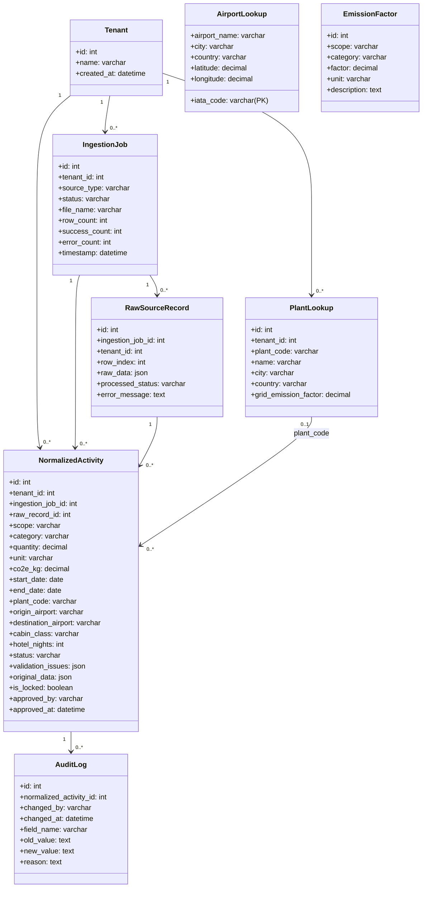

# Data Model Specification & Design Rationale (`MODEL.md`)

This document details the database architecture of the Breathe ESG prototype. It has been engineered to serve enterprise clients with strict security, transparency, multi-tenancy, and audit requirements.

---

## 1. Entity Relationship Overview

The system is built on **8 Core Entities** within SQLite, representing a relational mapping of activity logs, master directories, and compliance histories:

---

## 2. Key Architecture Pillars

### A. Multi-Tenancy Architecture
Multi-tenancy is handled via a **logical database-level isolation** scheme. The `Tenant` table serves as the root container. The tables `PlantLookup`, `IngestionJob`, `RawSourceRecord`, and `NormalizedActivity` are associated directly via a Foreign Key to the `Tenant` entity.
- All backend query sets are strictly scoped by the `tenant` parameter (e.g. `NormalizedActivity.objects.filter(tenant_id=tenant_id)`). This guarantees that client analysts never leak data to other organizations.

### B. Scope 1 / Scope 2 / Scope 3 Classification
Emissions are structured strictly per the GHG Protocol standard:
- **Scope 1 (Direct Emissions)**: Ingested from SAP fuel receipts (e.g. Stationary Diesel Combustion). Base normalized unit is Liters (`L`).
- **Scope 2 (Indirect Emissions)**: Pro-rated grid electricity from utility portal bills. Base normalized unit is kilowatt-hours (`kWh`). Grid coefficients are dynamically mapped based on facility Plant coordinates/regions.
- **Scope 3 (Other Indirect Emissions)**: Travel segment details (Economy/Business Flights, Taxi travel, Train rides, and Hotel nights) as well as general supply procurement records. Base normalized units are Passenger-Kilometers (`p-km`), Room-Nights, and Spend Currencies.

### C. Source-of-Truth Tracking & Archival
To remain highly compliant for third-party auditing, every normalized activity row is traceable directly back to its origin:
1. `RawSourceRecord` contains a `raw_data` JSON field which holds the exact, unmodified key-value pairs representing the raw imported CSV row before any transformations were made.
2. `NormalizedActivity` maintains a foreign key to `RawSourceRecord` and `IngestionJob`. If an analyst clicks into any row, they can inspect the original raw payload immediately inside the React drawer, creating an absolute audit trail.

### D. Unit Normalization Engine
Raw client files arrive with arbitrary units (e.g., German/English, imperial/metric).
- The `parsers.py` normalize units into canonical units (`L` for liquids, `KG` for weight, `kWh` for energy, `p-km` for flights, etc.) before computing carbon values.
- **Unit Conversions Built-in**:
  - Gallons (`GAL`) -> Liters (`L`) (multiplier `3.78541`)
  - Tons (`TO`) -> Kilograms (`KG`) (multiplier `1000`)
  - Liters/Tons German labels (`LITER`, `TONNE`) -> canonical system keys.

### E. Calendar Month Splitting & Interpolation
Utility billing cycles rarely align neatly with calendar months (e.g. May 12 to June 11). For monthly reporting, our system pro-rates utility records:
1. `get_days_per_month` dynamically identifies the calendar months crossed by the billing period.
2. Pro-rates the quantity consumed and total charges linearly based on the exact day counts falling within each month.
3. Creates separate, distinct `NormalizedActivity` rows in the database, maintaining full trace links to the original single `RawSourceRecord`.

### F. Strict Change Auditing & Locking
Compliance requires that data is immutable once submitted for audit, but adjustable before:
- **Locking**: When an analyst clicks "Lock & Sign-off", `is_locked` is set to `True`, freezing the database record. Subsequent update calls return a 400 Bad Request.
- **Audit Logs**: If an adjustment is made to an unlocked row (e.g. corrected quantity), a transaction-atomic `AuditLog` entry is logged. It stores the auditor's name, timestamps, exact field modified, pre-change value, post-change value, and a **strict manual justification explanation**.
